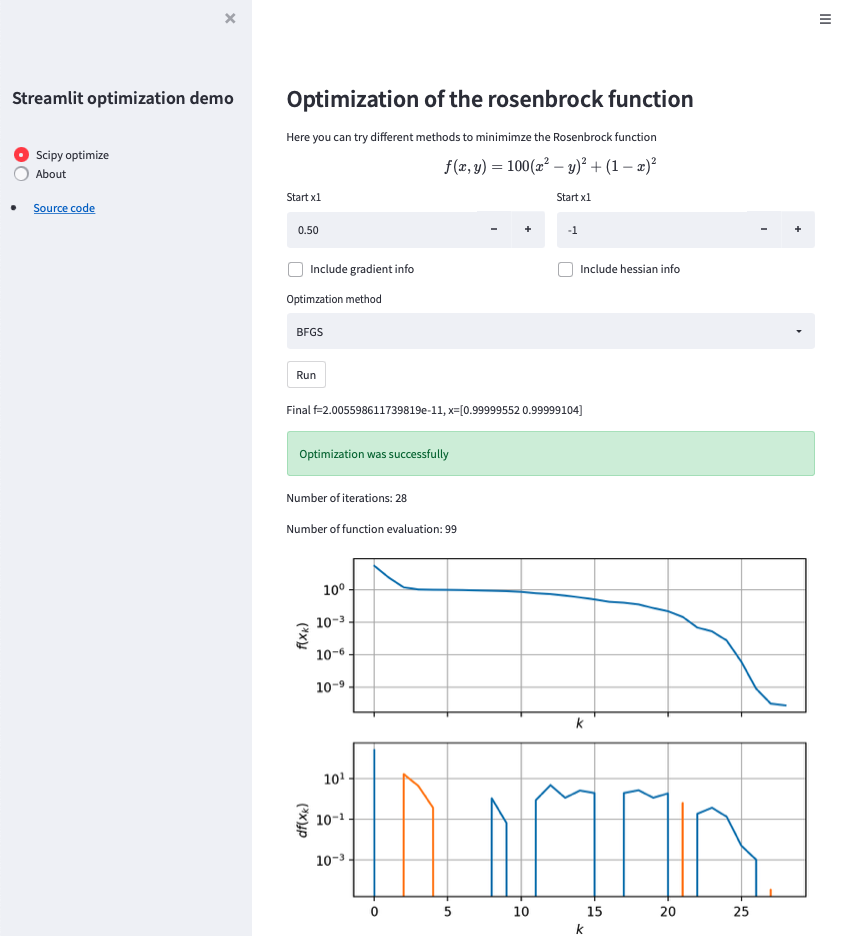
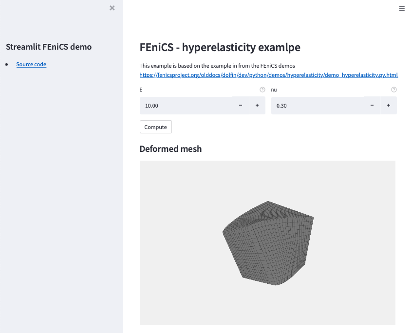

# Streamlit demo

Quick showcase on how to use [streamlit](https://streamlit.io).

Before you start you should make sure that you install the requirements
```
python -m pip install -r requirements.txt
```

---
There are two demos. 

One that uses scipy and numpy to test different optimization algorithms on the classical Rosenbrock function.


To run this demo execute
```
streamlit run demo_scipy_opt.py
```
---

The other one is a demo from the on of the [FEniCS demos about hyperelasticty](https://fenicsproject.org/olddocs/dolfin/dev/python/demos/hyperelasticity/demo_hyperelasticity.py.html) where you can play with different values of the elasticity parameters. 


Note that in order to run this demo you need to also have FEniCS installed

To run this demo execute
```
streamlit run demo_fenics.py
```

---

The main intention behind this repo is to show how to use, and the nice thing about including a FEniCS example is that we need to solve some expensive function which can be handled using caching.


